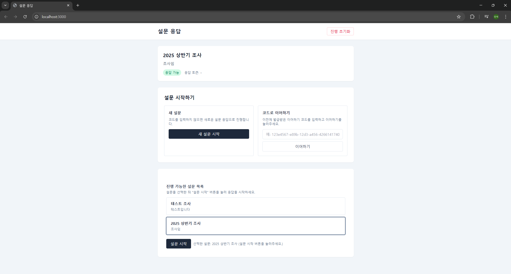
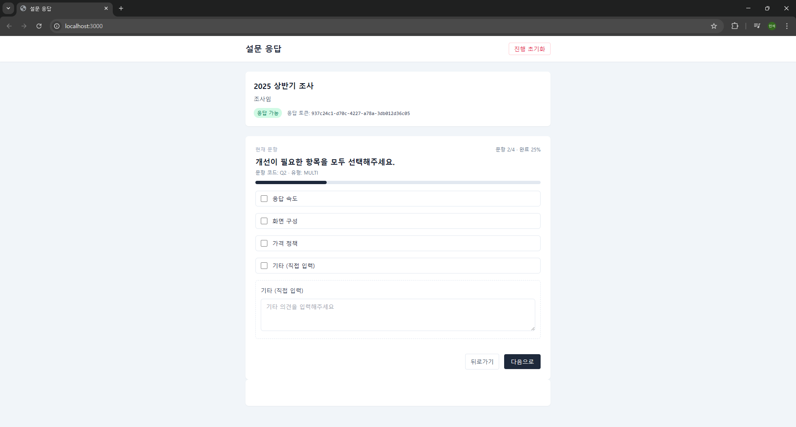
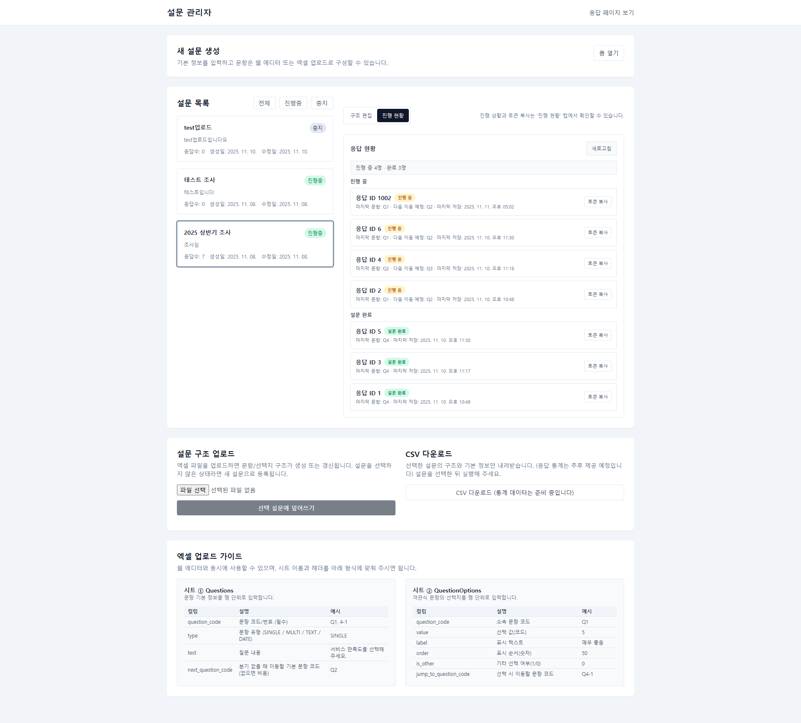
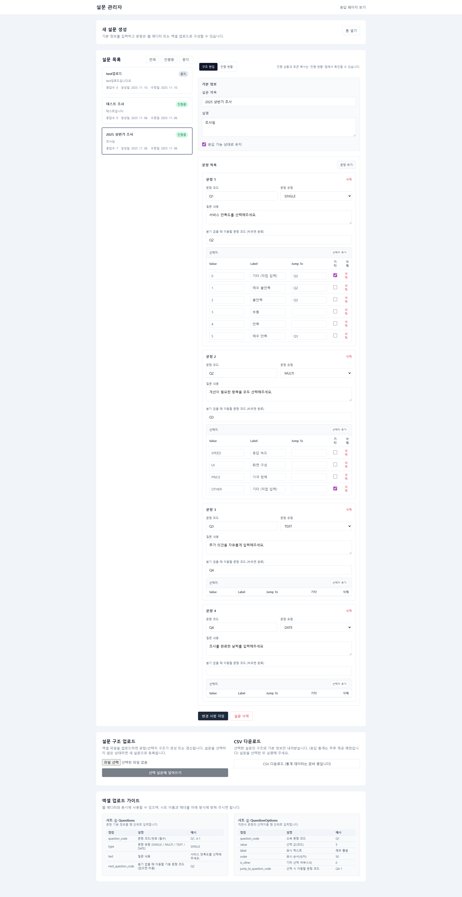
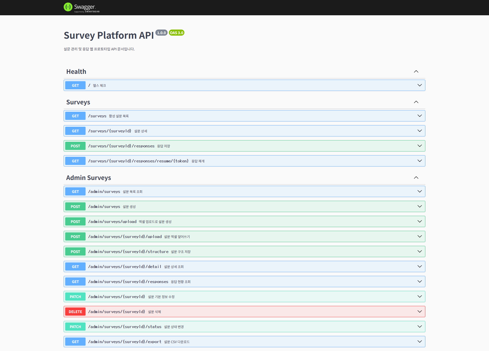

# 설문 관리 및 응답 플랫폼

이 프로젝트는 리서치 회사 웹 프로그래밍 포지션에 지원하기 위해 제작한 설문 관리·응답 데모입니다. 과거 조사원 아르바이트를 하면서 “이어하기” 기능이 없어 설문이 꺼지면 처음부터 다시 해야 하거나, 잘못 입력한 응답을 쉽게 고칠 수 없는 불편함을 겪었습니다. 현장 조사원, 응답자, 관리자 모두의 입장에서 필요한 흐름을 고민하며, 구조 편집과 응답 진행 현황을 한 화면에서 다룰 수 있는 프로토타입을 구현했습니다.

## 주요 기능

- **관리자(Admin) 화면** (`survey-frontend/admin.html`)
  - 설문 생성/수정/삭제 및 Excel 업로드·다운로드
  - 설문 구조 편집(문항/선택지·분기 설정)과 진행 현황 탭 전환
  - 진행 중/완료 응답 목록, 토큰 복사, 이어하기 지원
  - CSV 내보내기(통계 데이터는 추후 제공 예정)
- **응답자 화면** (`survey-frontend/index.html`)
  - 설문 목록 확인, 설문 시작 및 이어하기
  - 분기 로직 기반 다음 문항 이동, 진행률 표시
  - 문항별 응답 검증, 완료 후 결과 안내
- **백엔드 API** (`survey-backend`)
  - NestJS + Prisma 기반 REST API
  - 설문 구조 관리, 응답 저장/재개, CSV 출력
  - Prisma 스키마로 SQL Server 연동

## 화면 미리보기

### 응답자 메인 화면

- **메인 영역**: 진행 중과 신규 설문을 한눈에 보여주고 이어하기 기능을 바로 제공한다.

### 설문 응답 진행 화면

- **질문 영역**: 한 번에 한 문항씩 노출해 집중도를 높이고, 선택지에 따른 분기 조건으로 다음 문항을 결정한다.
- **UX**: 이전·다음 버튼과 진행률 표시함으로써 현재 위치를 파악하고 자연스럽게 이동할 수 있다.

### 관리자 메인 화면

- **운영 설문 목록**: 현재 운영 중인 설문을 한눈에 확인하고 CSV 설문 데이터를 업로드와 다운로드를 할 수 있다.
- **응답 집계 카드**: 설문별로 진행 중인 아이디와 완료된 아이디를 구분해 진행 상황을 추적한다.
- **토큰 관리**: 이어하기 토큰 발급/복사를 지원해 현장 조사원과 응답자 관리를 효율화한다.

### 설문 구조 편집 화면

- **설문 구조 편집 패널**: 섹션,문항,선택지를 계층 구조로 관리하며 새로운 설문 작성부터 업로드한 설문 수정까지 지원한다.
- **우측 상세 패널**: 선택한 요소의 조건,분기,유효성 설정을 즉시 조정해 복잡한 흐름도 쉽게 구성한다.

### API 문서 (Swagger)

- **Swagger UI**: `/docs` 엔드포인트에서 백엔드 API 명세를 확인하고 테스트 호출을 수행할 수 있다.
- **엔드포인트 그룹**: 관리자/응답자/헬스 체크 등 태그별로 정리되어 필요한 API를 빠르게 찾는다.
- **요청/응답 스키마**: Swagger 데코레이터 기반으로 생성된 스키마를 참고해 필수 값과 응답 구조를 명확히 파악한다.

## 기술 스택

- Frontend: HTML, jQuery, Tailwind CDN, 환경 변수 주입(`env.js`)
- Backend: NestJS, TypeScript, Prisma ORM
- Database: Microsoft SQL Server (Docker Compose로 로컬 실행)
- 기타: Excel(XLSX) 파싱, CSV 생성, 개발 모드 로그

## 폴더 구조

```
.
├── docker-compose.yml        # MSSQL 실행용 Compose 파일
├── README.md
├── survey-frontend/          # 관리자/응답자 정적 프런트엔드
│   ├── admin.html
│   ├── index.html
│   ├── env.js                # 실제 환경 변수 (git에 포함되지 않음)
│   └── lib/
│       └── jquery-3.7.1.min.js
└── survey-backend/           # NestJS + Prisma 백엔드
    ├── src/
    │   ├── admin/
    │   ├── survey/
    │   └── prisma/
    ├── prisma/schema.prisma
    ├── package.json
    ├── .env                  # 실제 환경 변수 (git에 포함되지 않음)
    └── 기타 설정 파일(tsconfig 등)
```

## 실행 방법 개요

### 1. Docker로 MSSQL 띄우기 (빌드 필요)

```bash
docker-compose up -d
```

- 기본 포트 1433으로 SQL Server가 실행되며, 백엔드 `.env`에서 동일한 접속 정보를 사용합니다.

### 2. 백엔드 (survey-backend)

```bash
cd survey-backend
npm install
npx prisma migrate deploy   # 해당 DB에 테이블 생성
npx prisma generate          # Prisma Client 생성
npm run build
npm run start:dev
```

- `.env` 파일에 데이터베이스 연결 문자열 등 환경변수를 설정합니다.
- 개발 중 스키마를 바꿨다면 `npx prisma migrate dev`로 마이그레이션과 생성을 동시에 수행할 수 있습니다.

### 3. 프론트엔드 (survey-frontend)

- 정적 HTML이므로 별도 빌드 없이 실행할 수 있습니다.
- `env.js`를 작성해 백엔드 URL 등을 설정합니다.
- 로컬 테스트 시 간단한 정적 서버(예: VSCode Live Server, `npx serve survey-frontend`)를 사용하면 편리합니다.

## 환경 변수 설정 예시

### survey-frontend/env.js (예시)
```javascript
window.SURVEY_ENV = {
  API_BASE_URL: 'http://localhost:<BACKEND_PORT>',
  API_PORT: <BACKEND_PORT>,
  FRONTEND_PORT: <FRONTEND_PORT>,
  DEFAULT_SURVEY_ID: 1,
};
```
- `env.js`는 Git에 커밋하지 않으며, 필요 시 위 예시를 참고해 작성합니다.

### survey-backend/.env (예시)
```env
NODE_ENV=development
PORT=<BACKEND_PORT>
DATABASE_URL="sqlserver://localhost:1433;database=SURVEY_DB;user=sa;password=<SA_PASSWORD>;encrypt=true;trustServerCertificate=true"
```
- `survey-backend/.env` 파일은 **Git에 포함되지 않으며**, 위 예시를 참고해 직접 작성합니다.
- `<BACKEND_PORT>`와 `<SA_PASSWORD>` 자리에 실제 실행 포트와 SA 비밀번호를 입력합니다.
- Docker Compose로 띄운 MSSQL과 동일한 접속 정보를 사용합니다.
- 필요 시 `NODE_ENV=production` 등으로 변경해 배포 환경을 조정할 수 있습니다.

### survey/docker-compose.yml (예시)
```
services:
  mssql:
    image: mcr.microsoft.com/mssql/server:2022-latest
    environment:
      ACCEPT_EULA: "Y"
      MSSQL_PID: "Developer"
      SA_PASSWORD: "<SA_PASSWORD>"
    ports:
      - "<HOST_DB_PORT>:1433"
    volumes:
      - mssql-data:/var/opt/mssql
    restart: unless-stopped

volumes:
  mssql-data:
```
위 Compose 예시는 로컬 개발 편의를 위해 제공되며, 비밀번호·포트 등 민감 값은 직접 채워야 합니다.

## 개발 동기와 경험

조사원으로 일하며 겪었던 이어하기 부족, 응답 수정 불편, 관리자-현장 간 정보 격차를 해결하고자 설계했습니다. 조사원은 실수해도 쉽게 복구할 수 있고, 응답자는 중단 없이 설문을 이어갈 수 있으며, 관리자는 설문 구조와 진행 상황을 한눈에 볼 수 있도록 하는 데 집중했습니다.

## 향후 확장 아이디어

- CSV 내보내기에 응답 통계(문항별 응답 수 등) 추가
- 관리자 인증/권한·접근 제어
- 응답자 화면 모바일 최적화
- 실사용 배포 스크립트와 Docker 이미지 정리

---